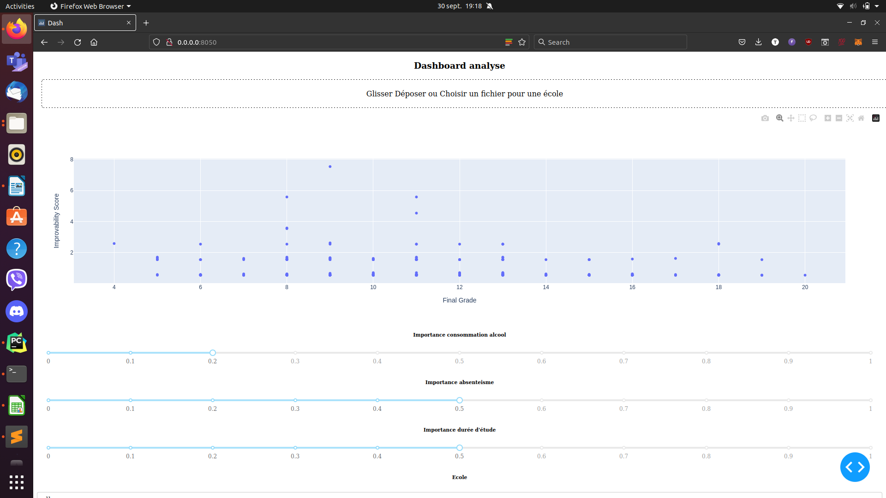
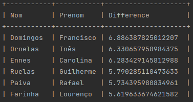

# Rendu test technique Ekinox

## Lancement

Une application Dash peut être lancée via un conteneur Docker via la commande ci-dessous:

```bash
chmod +x run.sh
./run.sh
```

On peut ensuite visualiser sur `http://0.0.0.0:8050/` le dashboard créé.

## Utilisation

On peut commencer par charger le csv contenant les données d'une école, ici dans le dossier data.

On peut ensuite selectionner les élèves que l'on souhaite pouvoir visualiser grâce à des dropdown.

On peut aussi visualiser l'influence de certains paramètres sur le score prédit.

On a alors une page de ce genre : 



## Autre approche

Il y a un script d'entrainement d'un petit reseau de neurone. Il permet de predire la note finale de l'élève en fonction de ses différentes features. 

Avec un entrainement rapide, on est capable de detecter une tendance. En regardant ensuite les élèves dont la note prédite est très différente de la note obtenue, on obtient la liste des élèves dont les notes ne correspondent pas à leurs caractéristiques. 

Je n'ai pas eu le temps d'integrer cette feature au dashboard. Les affichages sont dans la console, on les obtient via:

```bash
conda create --file requirements.txt --name environnement_test
conda activate environnement_test
python train.py
```

Exemple du rendu : 





## Réalisation

On a ici une première version de l'outil qui peut être modifiable à souhait. Il permet une première analyse simple et de tester si des facteurs sont importants.

Le client peut ainsi automatiquement tester plusieurs visualisations suivant ce qu'il considère important.

Cette solution se déploie facilement grâce à Docker.

